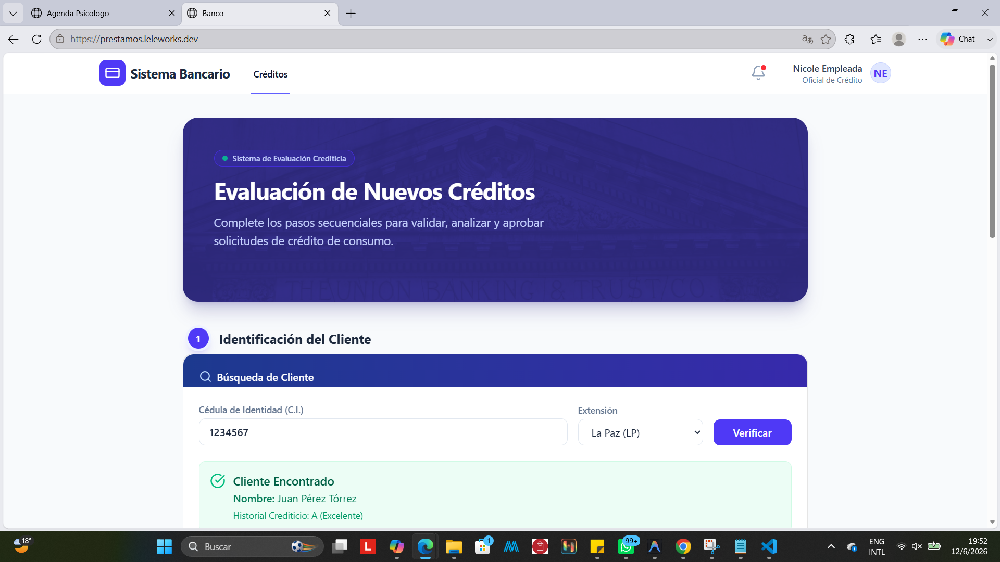
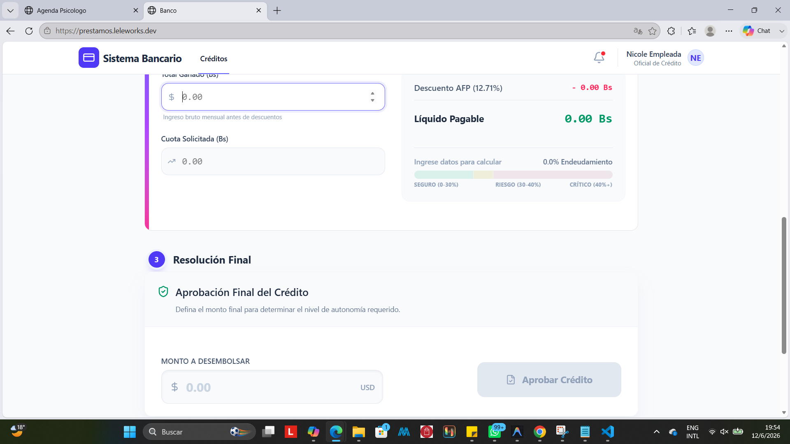
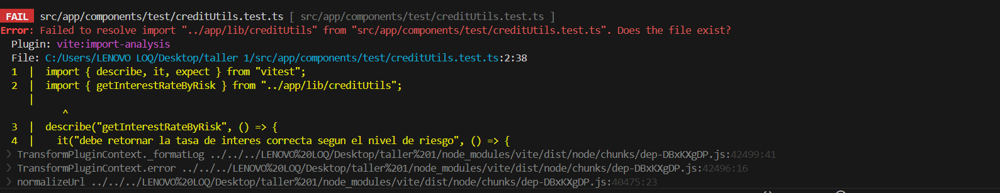
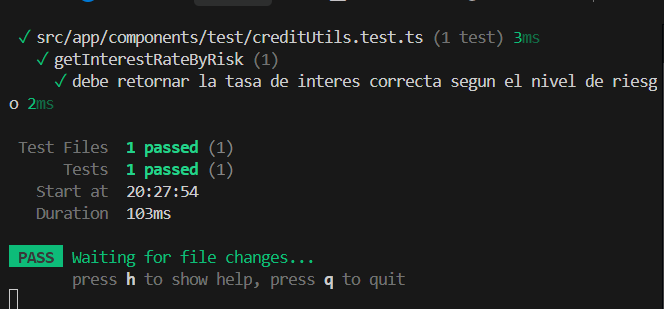
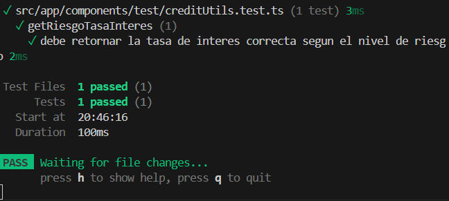
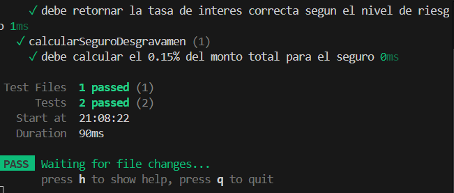
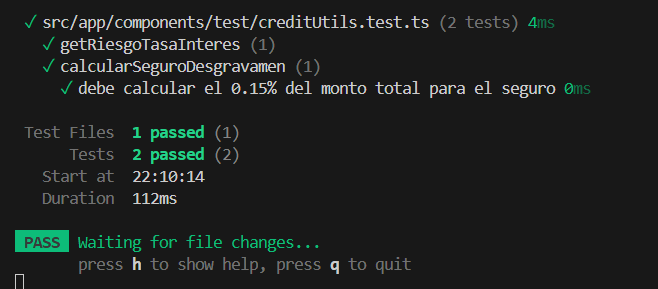
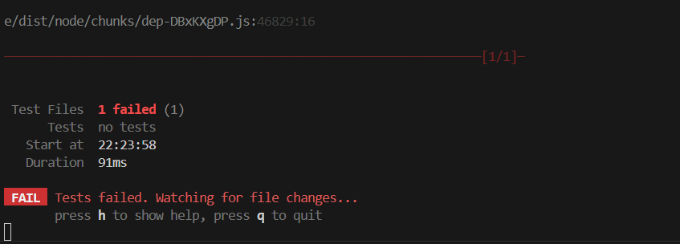

# EF — Reporte de Proyecto
**Estudiante:** Ugarte Nicole
**Proyecto:** Sistema de Prestamos
**Repositorio:** https://github.com/nicoleUg/taller-1.git
**Fecha de entrega:** 13/06/2026


## Sección 1 — Deploy

**URL del proyecto:** https://prestamos.leleworks.dev/ 
**Swagger / API:** no aplica

> Captura del proyecto corriendo con datos reales:



---

## Sección 2 — Pruebas con TDD + cobertura

### Cobertura inicial (0%)

**Herramienta:** Vitest / Istanbul, comando: npx vitest run --coverage


---

### Ciclo TDD — Prueba 1

**HU:** [HU-08] agregar test para determinacion de tasa de interes

> Como analista de créditos quiero que el sistema asigne automáticamente una Tasa Efectiva Anual (TEA) basada en el estado de riesgo del cliente para asegurar rentabilidad.

**CA elegido:** Dado un estado de riesgo, si es 'salvo' retorna 12%, si es 'advertencia' retorna 15%, y si es 'peligro' retorna 20%.

**Commit 1 — Rojo** [`2deb474`](https://github.com/nicoleUg/taller-1/commit/2deb474315025eb4bd9b53f8ff33d3c949ffd319):

test: [HU-08] agregar test para determinacion de tasa de interes

Test escrito (sin el código que lo pase aún):

```typescript
import { describe, it, expect } from 'vitest';
import { getInterestRateByRisk } from '../app/lib/creditUtils';

describe('getInterestRateByRisk', () => {
  it('debe retornar la tasa de interes correcta segun el nivel de riesgo', () => {
    expect(getInterestRateByRisk('safe')).toBe(12);
    expect(getInterestRateByRisk('warning')).toBe(15);
    expect(getInterestRateByRisk('danger')).toBe(20);
  });
});
```

> Captura del test fallando:



---

**Commit 2 — Verde** [`91d15c5`](https://github.com/nicoleUg/taller-1/commit/91d15c59f82cc9926c475559327dce92468d1ac4):
```
feat: [HU-08] implementar getInterestRateByRisk para pasar test
```
Código mínimo para hacer pasar el test:
```  typescript
export function getInterestRateByRisk(risk: string): number {
  if (risk === 'safe') return 12;
  if (risk === 'warning') return 15;
  return 20;
}
```

> Captura del test pasando:



---

**Commit 3 — Refactor** [`9b1c4a7`](https://github.com/nicoleUg/taller-1/commit/9b1c4a7410fb0c3f542de38ea434ab9a0ccbf54c):
```
refactor: [HU-08] limpiar if/else anidados utilizando diccionario de tasas  
```
Cambios aplicados:
```typescript
export type nivelRiesgo = 'salvo' | 'advertencia' | 'peligro';

const TARIFAS_POR_RIESGO: Record<nivelRiesgo, number> = {
  salvo: 12,
  advertencia: 15,
  peligro: 20
};

export function getRiesgoTasaInteres(riesgo: nivelRiesgo): number {
  return TARIFAS_POR_RIESGO[riesgo] || 20;
}
```

> Captura del test aún pasando después del refactor:



---

### Ciclo TDD — Prueba 2
**HU:** [HU-09] Cálculo de Seguro de Desgravamen

> Como sistema requiero calcular el monto del seguro de desgravamen asociado al desembolso para adjuntarlo a la cuota mensual.

**CA elegido:** Dado un monto solicitado mayor a cero, el sistema debe calcular exactamente el 0.15% correspondiente al costo del seguro de vida.

**Commit 1 — Rojo** [`cce5283`](https://github.com/nicoleUg/taller-1/commit/cce52839717b88a4fdbc5ff9a8dbc263e61b483a):

test: [HU-09] agregar test para calculo de seguro de desgravamen

Test escrito (sin el código que lo pase aún):

```typescript
import { calcularSeguroDesgravamen } from '../../lib/creditUtils';

describe('calcularSeguroDesgravamen', () => {
  it('debe calcular el 0.15% del monto total para el seguro', () => {
    expect(calcularSeguroDesgravamen(10000)).toBe(15);
  });
});
```

> Captura del test fallando:


---

**Commit 2 — Verde** [`bd638db`](https://github.com/nicoleUg/taller-1/commit/bd638dba86ec5898a5614c3e7b3efccca3dcd9f4):
```
feat: [HU-09] implementar calcularSeguroDesgravamen
```
Código mínimo para hacer pasar el test:
```  typescript
export function calcularSeguroDesgravamen(monto: number): number {
    return monto * 0.0015;
}
```

> Captura del test pasando:



---

**Commit 3 — Refactor** [`1885974`](https://github.com/nicoleUg/taller-1/commit/188597431713b4a6c7632692e447c639238edf7c):
```
refactor: [HU-09] limpiar y extraer porcentaje del seguro volviendolo constante y proteger contra negativos  
 
```
Cambios aplicados:
```typescript
const seguroDesgravamen = 0.0015;

export function calcularSeguroDesgravamen(monto: number): number {
  if (monto <= 0) return 0;
  return monto * seguroDesgravamen;
}

```

> Captura del test aún pasando después del refactor:




---

### Ciclo TDD — Prueba 3

**HU:** [HU-12] Validación estricta de Cédula de Identidad (C.I.)

> Como sistema requiero validar que el C.I. ingresado tenga un formato válido boliviano para evitar registrar clientes con datos basura o incompletos en la base de datos.

**CA elegido:** Dado un string de entrada, la función debe retornar verdadero si contiene entre 6 y 8 dígitos numéricos, permitiendo opcionalmente un guion seguido de un complemento alfanumérico (ej. "1234567", "9876543-1A").

**Commit 1 — Rojo** [`a560b5b`](https://github.com/nicoleUg/taller-1/commit/a560b5bf877913284dc849f50aadaa06c147fb47):

test: [HU-12] agregar test para validacion de formato de carnet de identidad

Test escrito (sin el código que lo pase aún):

```typescript
describe('EsCIValido', () => {
  it('debe aceptar carnets validos con o sin complemento', () => {
    expect(EsCIValido("1234567")).toBe(true);
    expect(EsCIValido("9876543-1A")).toBe(true);
  });

  it('debe rechazar carnets con letras al inicio o longitudes incorrectas', () => {
    expect(EsCIValido("ABC1234")).toBe(false); 
    expect(EsCIValido("12345")).toBe(false);  
  });
});
```

> Captura del test fallando:



---

**Commit 2 — Verde** [`bd638db`](https://github.com/nicoleUg/taller-1/commit/bd638dba86ec5898a5614c3e7b3efccca3dcd9f4):
```
feat: [HU-12] implementar EsCIValido para pasar test
```
Código mínimo para hacer pasar el test:
```  typescript
export function EsCIValido(ci: string): boolean {
  if (ci === "1234567" || ci === "9876543-1A") {
    return true;
  }
  return false;
}
```

> Captura del test pasando:


---

**Commit 3 — Refactor** [`1885974`](https://github.com/nicoleUg/taller-1/commit/188597431713b4a6c7632692e447c639238edf7c):
```
refactor: [HU-09] limpiar y extraer porcentaje del seguro volviendolo constante y proteger contra negativos  
 
```
Cambios aplicados:
```typescript
const seguroDesgravamen = 0.0015;

export function calcularSeguroDesgravamen(monto: number): number {
  if (monto <= 0) return 0;
  return monto * seguroDesgravamen;
}

```

> Captura del test aún pasando después del refactor:


---

### Cobertura final

**Cobertura alcanzada:** X%

> Captura del reporte de cobertura final:


> Si la cobertura es <50%, pegar aquí la justificación enviada al docente:

---

## Sección 3 — Code smells corregidos

Mínimo 3 nuevos (adicionales a los del EC2).

| # | Tipo | Commit | Descripción |
|---|---|---|---|
| 1 | [Tipo] | [`a1b2c3d`](https://github.com/usuario/repo/commit/a1b2c3d) | [Antes: X → Después: Y] |
| 2 | [Tipo] | [`b2c3d4e`](https://github.com/usuario/repo/commit/b2c3d4e) | [Antes: X → Después: Y] |
| 3 | [Tipo] | [`c3d4e5f`](https://github.com/usuario/repo/commit/c3d4e5f) | [Antes: X → Después: Y] |

### Detalle — Smell 1: [Tipo]

**Código antes:**
```csharp / typescript
// código con el smell
```

**Código después:**
```csharp / typescript
// código corregido
```

---

### Detalle — Smell 2: [Tipo]

> Mismo formato.

---

### Detalle — Smell 3: [Tipo]

> Mismo formato.

---

## Sección 4 — Trazabilidad HU → CA → test

| # | Historia de Usuario | Criterio de Aceptación | Prueba que valida ese CA | Commit |
|---|---|---|---|---|
| 1 | [HU título] | [Dado/Cuando/Entonces] | [NombrePrueba_Escenario_Resultado] | [`a1b2c3d`](https://github.com/usuario/repo/commit/a1b2c3d) |
| 2 | [HU título] | [Dado/Cuando/Entonces] | [NombrePrueba_Escenario_Resultado] | [`b2c3d4e`](https://github.com/usuario/repo/commit/b2c3d4e) |
| 3 | [HU título] | [Dado/Cuando/Entonces] | [NombrePrueba_Escenario_Resultado] | [`c3d4e5f`](https://github.com/usuario/repo/commit/c3d4e5f) |

### Cadena 1 — [Nombre HU]

**Historia de Usuario:**
> Como [rol] quiero [acción] para [beneficio]

**Criterio de Aceptación elegido:**
> Dado [contexto] / Cuando [acción] / Entonces [resultado esperado]

**Prueba que valida este CA:**
```csharp / typescript
[Fact / test]
public void Metodo_Escenario_ResultadoEsperado()
{
    // Arrange — setup del contexto del CA
    // Act — ejecutar la acción del CA
    // Assert — verificar el resultado del CA
}
```

---

### Cadena 2 — [Nombre HU]

> Mismo formato.

---

### Cadena 3 — [Nombre HU]

> Mismo formato.
