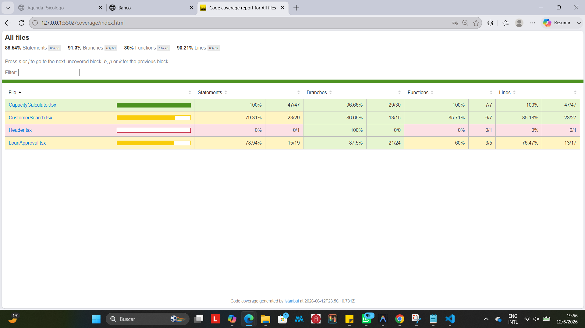
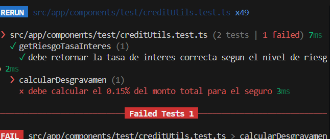
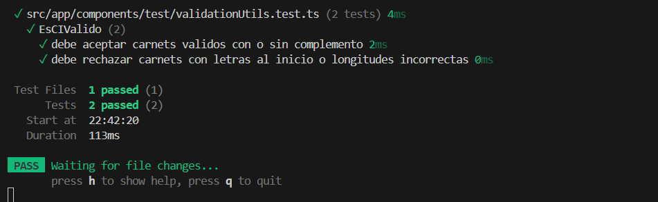
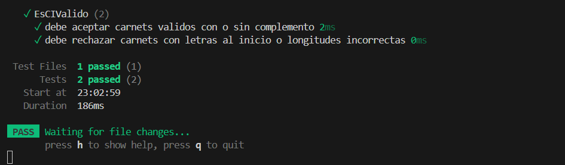
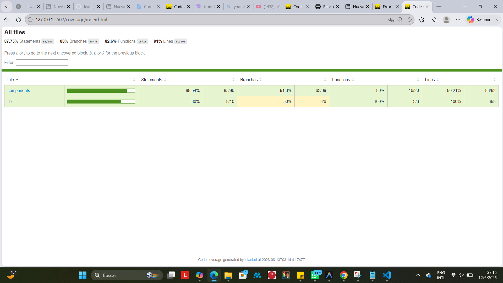
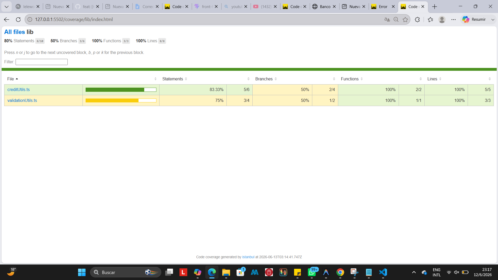
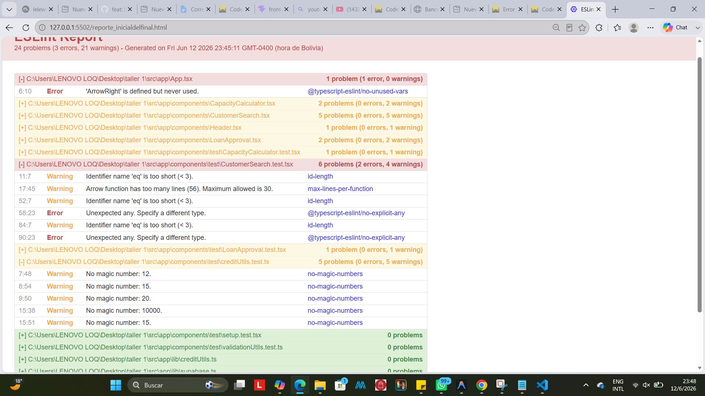
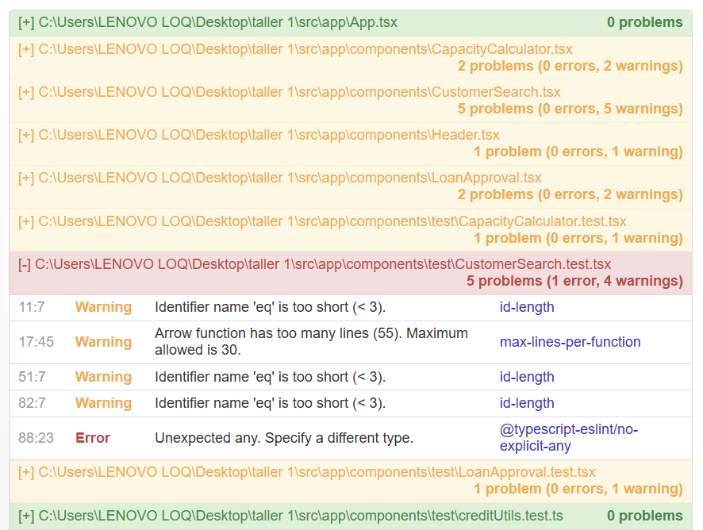

# EF — Reporte de Proyecto 
**Estudiante:** Ugarte Nicole
**Proyecto:** Sistema de Prestamos
**Repositorio:** https://github.com/nicoleUg/taller-1.git
**Fecha de entrega:** 13/06/2026


## Sección 1 — Deploy

**URL del proyecto:** https://prestamos.leleworks.dev/ 
**Swagger / API:** no aplica

> Captura del proyecto corriendo con datos reales:


---

## Sección 2 — Pruebas con TDD + cobertura

### Cobertura inicial (0%)

**Herramienta:** Vitest / Istanbul, comando: npx vitest run --coverage



---

### Ciclo TDD — Prueba 1

**HU:** [HU-08] agregar test para determinacion de tasa de interes

> Como analista de créditos quiero que el sistema asigne automáticamente una Tasa Efectiva Anual (TEA) basada en el estado de riesgo del cliente para asegurar rentabilidad.

**CA elegido:** Dado un estado de riesgo, si es 'salvo' retorna 12%, si es 'advertencia' retorna 15%, y si es 'peligro' retorna 20%.

**Commit 1 — Rojo** [`2deb474`](https://github.com/nicoleUg/taller-1/commit/2deb474315025eb4bd9b53f8ff33d3c949ffd319):

test: [HU-08] agregar test para determinacion de tasa de interes

Test escrito (sin el código que lo pase aún):

```typescript
import { describe, it, expect } from 'vitest';
import { getInterestRateByRisk } from '../app/lib/creditUtils';

describe('getInterestRateByRisk', () => {
  it('debe retornar la tasa de interes correcta segun el nivel de riesgo', () => {
    expect(getInterestRateByRisk('safe')).toBe(12);
    expect(getInterestRateByRisk('warning')).toBe(15);
    expect(getInterestRateByRisk('danger')).toBe(20);
  });
});
```

> Captura del test fallando:


---

**Commit 2 — Verde** [`91d15c5`](https://github.com/nicoleUg/taller-1/commit/91d15c59f82cc9926c475559327dce92468d1ac4):
```
feat: [HU-08] implementar getInterestRateByRisk para pasar test
```
Código mínimo para hacer pasar el test:
```  typescript
export function getInterestRateByRisk(risk: string): number {
  if (risk === 'safe') return 12;
  if (risk === 'warning') return 15;
  return 20;
}
```

> Captura del test pasando:


---

**Commit 3 — Refactor** [`9b1c4a7`](https://github.com/nicoleUg/taller-1/commit/9b1c4a7410fb0c3f542de38ea434ab9a0ccbf54c):
```
refactor: [HU-08] limpiar if/else anidados utilizando diccionario de tasas  
```
Cambios aplicados:
```typescript
export type nivelRiesgo = 'salvo' | 'advertencia' | 'peligro';

const TARIFAS_POR_RIESGO: Record<nivelRiesgo, number> = {
  salvo: 12,
  advertencia: 15,
  peligro: 20
};

export function getRiesgoTasaInteres(riesgo: nivelRiesgo): number {
  return TARIFAS_POR_RIESGO[riesgo] || 20;
}
```

> Captura del test aún pasando después del refactor:


---

### Ciclo TDD — Prueba 2
**HU:** [HU-09] Cálculo de Seguro de Desgravamen

> Como sistema requiero calcular el monto del seguro de desgravamen asociado al desembolso para adjuntarlo a la cuota mensual.

**CA elegido:** Dado un monto solicitado mayor a cero, el sistema debe calcular exactamente el 0.15% correspondiente al costo del seguro de vida.

**Commit 1 — Rojo** [`cce5283`](https://github.com/nicoleUg/taller-1/commit/cce52839717b88a4fdbc5ff9a8dbc263e61b483a):

test: [HU-09] agregar test para calculo de seguro de desgravamen

Test escrito (sin el código que lo pase aún):

```typescript
import { calcularSeguroDesgravamen } from '../../lib/creditUtils';

describe('calcularSeguroDesgravamen', () => {
  it('debe calcular el 0.15% del monto total para el seguro', () => {
    expect(calcularSeguroDesgravamen(10000)).toBe(15);
  });
});
```

> Captura del test fallando:



---
**Commit 2 — Verde** [`23431c1`](https://github.com/nicoleUg/taller-1/commit/23431c1931baa0ebdc376c0a3fd163c588d08ce7):         
```
feat: [HU-09] implementar calcularSeguroDesgravamen
```
Código mínimo para hacer pasar el test:
```  typescript
export function calcularSeguroDesgravamen(monto: number): number {
    return monto * 0.0015;
}
```

> Captura del test pasando:


---

**Commit 3 — Refactor** [`1885974`](https://github.com/nicoleUg/taller-1/commit/188597431713b4a6c7632692e447c639238edf7c):
```
refactor: [HU-09] limpiar y extraer porcentaje del seguro volviendolo constante y proteger contra negativos  
 
```
Cambios aplicados:
```typescript
const seguroDesgravamen = 0.0015;

export function calcularSeguroDesgravamen(monto: number): number {
  if (monto <= 0) return 0;
  return monto * seguroDesgravamen;
}

```

> Captura del test aún pasando después del refactor:


---

### Ciclo TDD — Prueba 3

**HU:** [HU-12] Validación estricta de Cédula de Identidad (C.I.)

> Como sistema requiero validar que el C.I. ingresado tenga un formato válido boliviano para evitar registrar clientes con datos basura o incompletos en la base de datos.

**CA elegido:** Dado un string de entrada, la función debe retornar verdadero si contiene entre 6 y 8 dígitos numéricos, permitiendo opcionalmente un guion seguido de un complemento alfanumérico (ej. "1234567", "9876543-1A").

**Commit 1 — Rojo** [`a560b5b`](https://github.com/nicoleUg/taller-1/commit/a560b5bf877913284dc849f50aadaa06c147fb47):

test: [HU-12] agregar test para validacion de formato de carnet de identidad

Test escrito (sin el código que lo pase aún):

```typescript
describe('EsCIValido', () => {
  it('debe aceptar carnets validos con o sin complemento', () => {
    expect(EsCIValido("1234567")).toBe(true);
    expect(EsCIValido("9876543-1A")).toBe(true);
  });

  it('debe rechazar carnets con letras al inicio o longitudes incorrectas', () => {
    expect(EsCIValido("ABC1234")).toBe(false); 
    expect(EsCIValido("12345")).toBe(false);  
  });
});
```

> Captura del test fallando:


---

**Commit 2 — Verde** [`23431c1`](https://github.com/nicoleUg/taller-1/commit/23431c1931baa0ebdc376c0a3fd163c588d08ce7):
```
feat: [HU-12] implementar EsCIValido para pasar test
```
Código mínimo para hacer pasar el test:
```  typescript
export function EsCIValido(ci: string): boolean {
  if (ci === "1234567" || ci === "9876543-1A") {
    return true;
  }
  return false;
}
```

> Captura del test pasando:



---

**Commit 3 — Refactor** [`08a1fc7`](https://github.com/nicoleUg/taller-1/commit/08a1fc733689ebbaa87c00ab100f85acf59c0bd9):
```
refactor: [HU-12] limpiar e implementar expresion regular para validacion de CI
```
Cambios aplicados:
```typescript
export function EsCIValido(ci: string): boolean {
  if (!ci) return false;
  const ciRegex = /^\d{6,8}(-[A-Za-z0-9]{1,2})?$/;
  return ciRegex.test(ci.trim());
}
```

> Captura del test aún pasando después del refactor:



---

### Cobertura final

**Cobertura alcanzada:** X%

> Captura del reporte de cobertura final:




> La cobertura del codigo bajo a un 87.73% ya que anteriormente hicimos pruebas de integracion y estas serian como tal pruebas unitarias de negocio que anteriormente no estaban cubiertas

---

## Sección 3 — Code smells corregidos

 

Mínimo 3 nuevos (adicionales a los del EC2).

| # | Tipo | Commit | Descripción |
|---|---|---|---|
| 1 | Dead Code (Imports sin usar) | [`d558177`](https://github.com/nicoleUg/taller-1/commit/d558177c05b2404965b077e0ce192f7f69fda303) | Antes: Importación de ArrowRight no utilizada en App.tsx. → Después: Eliminación del import para limpiar el código y resolver el error de ESLint.|
| 2 | Inseguridad de Tipos (Uso de any) | [`1006d07`](https://github.com/nicoleUg/taller-1/commit/1006d07b0a5e4c9c1dfabf3f3774c10ef27dfb66) | Antes: Casteo de Supabase con any en CustomerSearch.test.tsx → Después: Uso de tipado correcto de Vitest (ReturnType<typeof vi.fn>) para el mock. |
| 3 | Magic Numbers | [`829e76a`](https://github.com/nicoleUg/taller-1/commit/829e76af3898fb1c2bd638722bf0b9c86af24f91) | Antes: Números quemados en aserciones de creditUtils.test.ts (12, 15, 20, 10000) → Después: Extracción de los valores a constantes semánticas. |

### Detalle — Smell 1: Dead code

**Código antes:**
``` typescript
import { Header } from './components/Header';
import { CustomerSearch } from './components/CustomerSearch';
import { CapacityCalculator } from './components/CapacityCalculator';
import { LoanApproval } from './components/LoanApproval';
import { ArrowRight } from 'lucide-react';
```

**Código después:**
```typescript
import { Header } from './components/Header';
import { CustomerSearch } from './components/CustomerSearch';
import { CapacityCalculator } from './components/CapacityCalculator';
import { LoanApproval } from './components/LoanApproval';
```

---

### Detalle — Smell 2: Inseguridad de tipos


**Código antes:**
``` typescript
  it('Debe mostrar "Cliente Encontrado" cuando la búsqueda es exitosa', async () => {
    const mockQuery = {
      select: vi.fn().mockReturnThis(),
      eq: vi.fn().mockReturnThis(),
      maybeSingle: vi.fn().mockResolvedValue({
        data: { nombre_completo: 'Juan Pérez Tórrez', historial_crediticio: 'A (Excelente)' },
        error: null
      })
    };
    (supabase.from as any).mockReturnValue(mockQuery);
```

**Código después:**
```typescript
    it('Debe mostrar "Cliente Encontrado" cuando la búsqueda es exitosa', async () => {
    const mockQuery = {
      select: vi.fn().mockReturnThis(),
      eq: vi.fn().mockReturnThis(),
      maybeSingle: vi.fn().mockResolvedValue({ 
        data: { nombre_completo: 'Juan Pérez Tórrez', historial_crediticio: 'A (Excelente)' },
        error: null })
    };
    (supabase.from as ReturnType<typeof vi.fn>).mockReturnValue(mockQuery);
```

---

### Detalle — Smell 3: Magic Numbers


**Código antes:**
``` typescript
describe('getRiesgoTasaInteres', () => {
  it('debe retornar la tasa de interes correcta segun el nivel de riesgo', () => {
    expect(getRiesgoTasaInteres('salvo')).toBe(12);
    expect(getRiesgoTasaInteres('advertencia')).toBe(15);
    expect(getRiesgoTasaInteres('peligro')).toBe(20);
  });
});

describe('calcularSeguroDesgravamen', () => {
  it('debe calcular el 0.15% del monto total para el seguro', () => {
    expect(calcularSeguroDesgravamen(10000)).toBe(15);
  });
});
```

**Código después:**
```typescript
const TASA_SALVO = 12;
const TASA_ADVERTENCIA = 15;
const TASA_PELIGRO = 20;

const MONTO_PRUEBA = 10000;
const SEGURO_ESPERADO = 15;

describe('getRiesgoTasaInteres', () => {
  it('debe retornar la tasa de interes correcta segun el nivel de riesgo', () => {
    expect(getRiesgoTasaInteres('salvo')).toBe(TASA_SALVO);
    expect(getRiesgoTasaInteres('advertencia')).toBe(TASA_ADVERTENCIA);
    expect(getRiesgoTasaInteres('peligro')).toBe(TASA_PELIGRO);
  });
});

describe('calcularSeguroDesgravamen', () => {
  it('debe calcular el 0.15% del monto total para el seguro', () => {
    expect(calcularSeguroDesgravamen(MONTO_PRUEBA)).toBe(SEGURO_ESPERADO);
  });
});
```

---

## Sección 4 — Trazabilidad HU → CA → test

| # | Historia de Usuario | Criterio de Aceptación | Prueba que valida ese CA | Commit |
|---|---|---|---|---|
| 1 | [HU-08] Determinación de Tasa según Riesgo | Dado el estado de riesgo / Cuando es advertencia / Entonces asigna 15% | getRiesgoTasaInteres_NivelRiesgoAdvertencia_Retorna15 | [`9b1c4a7`](https://github.com/nicoleUg/taller-1/commit/9b1c4a7410fb0c3f542de38ea434ab9a0ccbf54c) |
| 2 | [HU-09] Cálculo de Seguro de Desgravamen | Dado el monto aprobado / Cuando calcula el seguro / Entonces retorna 0.15% |calcularSeguroDesgravamen_MontoPositivo_Calcula015 | [`1885974`](https://github.com/nicoleUg/taller-1/commit/188597431713b4a6c7632692e447c639238edf7c) |
| 3 | [HU-12] Validación estricta de C.I. | [Dado un C.I. / Cuando tiene formato incorrecto / Entonces retorna falso] |EsCIValido_FormatoIncorrecto_RetornaFalse| [`08a1fc7`](https://github.com/nicoleUg/taller-1/commit/08a1fc733689ebbaa87c00ab100f85acf59c0bd9) |

### Cadena 1 — [HU-08] Determinación de Tasa según Riesgo

**Historia de Usuario:**
> Como analista de créditos quiero que el sistema asigne automáticamente una Tasa Efectiva Anual basada en el estado de riesgo del cliente para asegurar rentabilidad.

**Criterio de Aceptación elegido:**
> Dado un estado de riesgo previamente calculado como "advertencia" / Cuando el sistema consulta la tasa base aplicable / Entonces retorna un 15(%).

**Prueba que valida este CA:**
``` typescript
it('debe retornar la tasa de interes correcta segun el nivel de riesgo', () => {
    // Arrange — setup del contexto del CA
    const riesgoAsignado = 'advertencia';
    const TASA_ADVERTENCIA = 15;
    
    // Act — ejecutar la acción del CA
    const tasaCalculada = getRiesgoTasaInteres(riesgoAsignado);
    
    // Assert — verificar el resultado del CA
    expect(tasaCalculada).toBe(TASA_ADVERTENCIA);
});
```

---

### Cadena 2 — [HU-09] Cálculo de Seguro de Desgravamen

**Historia de Usuario:**
> Como analista de créditos quiero que el sistema calcule el monto del seguro de desgravamen asociado al desembolso para adjuntarlo a la cuota mensual

**Criterio de Aceptación elegido:**
> Dado un monto de crédito solicitado de $10,000 / Cuando el módulo financiero procesa los costos anexos / Entonces calcula un cargo exacto de $15 (0.15%).

**Prueba que valida este CA:**
``` typescript
it('debe calcular el 0.15% del monto total para el seguro', () => {
    // Arrange — setup del contexto del CA
    const MONTO_PRUEBA = 10000;
    const SEGURO_ESPERADO = 15;
    
    // Act — ejecutar la acción del CA
    const seguroCalculado = calcularSeguroDesgravamen(MONTO_PRUEBA);
    
    // Assert — verificar el resultado del CA
    expect(seguroCalculado).toBe(SEGURO_ESPERADO);
});
```

---

### Cadena 3 — [HU-12] Validación estricta de Cédula de Identidad (C.I.)

**Historia de Usuario:**
> Como analista de créditos requiero que el sistema valide que el C.I. ingresado tenga un formato válido  para evitar registrar clientes con datos basura o incompletos en la base de datos.

**Criterio de Aceptación elegido:**
> Dado un campo de registro de cliente / Cuando el operador ingresa un número de carnet demasiado corto ("12345") o con letras inapropiadas ("ABC1234") / Entonces la función de validación retorna falso.

**Prueba que valida este CA:**
``` typescript
it('debe rechazar carnets con letras al inicio o longitudes incorrectas', () => {
    // Arrange — setup del contexto del CA
    const carnetConLetras = "ABC1234";
    const carnetMuyCorto = "12345";

    // Act — ejecutar la acción del CA
    const esValidoLetras = EsCIValido(carnetConLetras);
    const esValidoCorto = EsCIValido(carnetMuyCorto);

    // Assert — verificar el resultado del CA
    expect(esValidoLetras).toBe(false);
    expect(esValidoCorto).toBe(false);
});
```
